# Forge

[](https://github.com/pugalenthi0928/training-data-factory/actions)
[](https://www.python.org/)
[](LICENSE)

Generate, screen and benchmark training datasets with source-aware splits, contamination checks and reproducible evaluation.

Forge turns documents into task-specific examples and then produces a verifiable dataset release. Every stage declares its inputs, outputs, configuration, model, prompt identity, and content-derived cache key. A run can resume after failure without trusting stale or modified artifacts.

**[Run the browser demo](https://pugalenthi0928.github.io/training-data-factory/demo.html) | [Evidence](https://pugalenthi0928.github.io/training-data-factory/) | [Technical controls](https://pugalenthi0928.github.io/training-data-factory/technical.html) | [Engineering roadmap](docs/engineering-roadmap.md)**

The browser demo runs deterministic provenance, contamination, and source-safe split controls without installation or an API key. It is a smoke demo of pipeline behaviour, not a model-quality benchmark.

## Current status

Forge is in a technical hardening phase. Verifiable releases, one typed pipeline core, source and record governance, multi-layer deduplication, dataset profiling, and layered contamination checks are implemented. Candidate releases require declared source usage rights and a configured semantic similarity backend. Smoke releases may disable semantic checks, and their manifests say so.

Historical model results are not presented as independent evidence. The earlier run used references derived from the same generation process, and the same model family was used for generation and judging. Those artifacts are retained for traceability, not as a headline performance claim.

The next release gate is Stage 4: an independently authored evaluation set plus a human-reviewed scoring subset.

## Why this repository exists

Training data work is easy to demo and difficult to validate. Forge makes the trust boundaries visible:

| Risk | Repository control |
| --- | --- |
| The same source appears in train and test | Whole documents are assigned to one partition by `document_id` |
| Provenance changes between runs | Document and chunk IDs are content-derived and deterministic |
| A split cannot be audited | The split manifest records counts, overlap checks, seed, and SHA-256 artifact hashes |
| Evaluation data leaks into training | A supplied benchmark is mandatory and contamination can fail the run |
| A statistical test is mislabeled | The benchmark reports a paired randomization test and a paired bootstrap confidence interval separately |
| A failed stage is silently ignored | Structured failure events are recorded and the run exits fail-closed |
| A resumed run trusts stale files | Cache hits require the same stage contract, input hashes, configuration, and verified output hashes |
| Two entry points behave differently | The `forge` CLI and Python API call the same typed stage graph |
| A source has unclear usage rights | Candidate builds require a source-rights manifest and permitted training use |
| Structured identifiers reach training data | Source and record governance reject or redact detected identifiers before release |
| Duplicate wording inflates the corpus | Exact, MinHash LSH, Jaccard, and optional embedding controls quarantine duplicates with reason codes |
| Curation choices disappear | Kept and rejected rows carry machine-readable audit decisions and release artifacts include a dataset profile |

## Pipeline

```mermaid
flowchart LR
    A[Source documents] --> B[Ingest]
    B --> C[Source rights and privacy]
    C --> D[Generate]
    D --> E[Quality and schema]
    E --> F[Record privacy]
    F --> G[Exact fuzzy semantic dedupe]
    G --> H[Judge and difficulty]
    H --> I[Layered contamination]
    I --> J[Select and source split]
    J --> K[Dataset profile]
    K --> L[Release gates and Croissant]
```



The training and evaluation adapter contracts are defined, but the current release workflow stops at a verified dataset. Portable training and independent evaluation remain explicit later gates.

## Quick start

Requirements: Python 3.11 or newer.

```bash
git clone https://github.com/pugalenthi0928/training-data-factory.git
cd training-data-factory
make install
make forge
```

`make forge` is an offline smoke run. It uses the dummy model and a small synthetic contamination fixture to exercise the pipeline without API calls. The fixture tests the mechanism only. It is not a model benchmark.

Outputs are written to a timestamped directory under `runs/`, including:

- `config.json`
- `documents.jsonl`
- `source_governance_report.json`
- `rejected_documents.jsonl`
- `record_governance_report.json`
- `rejected_records.jsonl`
- `dedupe_report.json`
- `dedupe_rejections.jsonl`
- `pipeline_log.json`
- `pipeline_events.jsonl`
- `contamination_report.json`
- `split_manifest.json`
- `dataset_profile.json`
- `train.jsonl`
- `test.jsonl`
- `release_manifest.json`
- `croissant.json`

The release manifest fingerprints the source inputs, benchmark inputs, and output artifacts. It blocks release when pipeline stages fail, contamination is detected, source partitions overlap, counts disagree, or artifact hashes do not match. The release ID is content-addressed and can be verified independently:

```bash
python scripts/release_dataset.py \
  --run-dir runs/forge_YYYYMMDD_HHMMSS \
  --verify
```

Run the same command again with the same output directory to resume. Forge only reports a cache hit when the stage contract and inputs match and every cached output still has its recorded content hash. Use `--no-resume` to deliberately execute every stage again.

## Run with a real generator

Provide your own independent benchmark and source-rights manifest. Each benchmark JSONL record should contain text in a supported field such as `question`, `text`, `input`, or `context`.

```bash
export OPENAI_API_KEY="your-key"
export FORGE_BENCHMARK_FILE="/absolute/path/to/independent_eval.jsonl"
export FORGE_SOURCE_MANIFEST="/absolute/path/to/source_rights.json"
make forge-live
```

The live command uses OpenAI embeddings for semantic similarity. It fails if the rights manifest is absent, a source does not permit training use, the benchmark is missing, or contamination crosses a configured threshold. It creates a candidate dataset release. Portable training remains outside this workflow until its backend and evaluation boundary can be tested in CI.

## Source-rights policy

Candidate builds require one entry per loaded source file. Relative paths resolve from the manifest location.

```json
[
  {
    "source_path": "sources/guide.txt",
    "origin": "project documentation",
    "license": "CC-BY-4.0",
    "permitted_uses": ["training", "evaluation"],
    "rights_holder": "Example publisher"
  }
]
```

Unknown licenses are allowed only in a smoke release. Disallowed use fails source governance. Detected email addresses, payment cards, Australian tax file numbers, US Social Security numbers, IPv4 addresses, and Australian phone patterns can be rejected or redacted. This deterministic detector is a baseline for structured identifiers, not a guarantee that every personal identifier will be found.

## Curation calibration

```bash
make curation-calibration
```

The repository fixture contains 12 labelled pairs across exact copies, near duplicates, semantic paraphrases, unrelated pairs, and hard negatives. On that deliberately small fixture, the selected MinHash LSH plus Jaccard setting records precision `0.833333`, recall `0.625`, F1 `0.714286`, three bootstrap seeds, and a 95 percent F1 interval. These values test detector behaviour. They are not estimates of production-corpus quality.

The offline command does not claim semantic calibration. Candidate runs must select `openai` or `sentence_transformers`, record the model and revision, and calibrate thresholds for the target corpus. Tests inject a controlled encoder to prove that paraphrased duplicates and benchmark records take the semantic rejection path.

## Source-safe split

The split command groups records by `document_id`. It refuses rows without source provenance and refuses datasets with fewer than two unique sources.

```bash
python scripts/split_dataset.py \
  --input run/dataset.jsonl \
  --train-output run/train.jsonl \
  --test-output run/test.jsonl \
  --manifest-output run/split_manifest.json \
  --test-fraction 0.2 \
  --seed 42
```

The command verifies that neither `document_id` nor available `chunk_id` values cross partitions.

## Evaluation semantics

The benchmark harness compares paired predictions with the same references and reports:

- ROUGE-1, ROUGE-2, and ROUGE-L
- exact match
- paired mean deltas
- a one-sided paired randomization p-value with plus-one correction
- a 95 percent paired bootstrap interval for the ROUGE-L delta
- the seed and resample count used by each procedure

These statistics quantify uncertainty in a particular evaluation set. They do not establish general model quality, remove judge bias, or substitute for an independently constructed benchmark.

## Repository layout

```text
src/forge/
  calibration.py     Labelled control evaluation and bootstrap intervals
  contracts.py       Typed stage, artifact, model, prompt, training, and evaluation contracts
  governance.py      Source rights, schema decisions, and structured PII controls
  pipeline.py        Content-keyed execution, event evidence, verified cache, and resume
  profiling.py       Source, task, quality, difficulty, and rejection profile
  similarity.py      Exact, MinHash LSH, Jaccard, and embedding adapters
  stages.py          Canonical ingest, generation, curation, contamination, and split stages
  workflow.py        Shared API used by the CLI, tests, workers, and future service
  cli.py             Installed `forge` command

src/training_data_robo/
  models.py          Stable document, chunk, and example provenance
  contamination.py   N-gram overlap detection
  judge.py           Rubric-based model judging
  selector.py        Selection strategies
  releases.py        Content-addressed release gates and Croissant metadata

scripts/
  run_forge.py            End-to-end pipeline entry point
  split_dataset.py        Source-grouped train and test split
  check_contamination.py  Benchmark overlap gate
  benchmark.py            Paired model comparison and uncertainty
  finetune_mlx.py         Local LoRA fine-tuning
  release_dataset.py      Release creation and independent verification
  evaluate_curation.py    Labelled dedupe calibration report

tests/                    Unit, property, provenance, and integrity tests
sample_docs/              Public smoke-test source documents
sample_benchmarks/        Synthetic contamination mechanism fixture
```

`training_data_robo` remains available as a compatibility package. New orchestration code should import `forge`. See the [migration guide](docs/migration-v1.md).

## Development checks

```bash
make lint
make typecheck
make test
make coverage
```

CI runs linting, format checks, type checking, syntax compilation, tests, and a coverage threshold on every push and pull request.

## Known limitations

- Smoke releases run lexical and fuzzy contamination controls but disable semantic embeddings.
- The current judge is model-based. A human-reviewed subset is still required before publishing evaluation claims.
- Embedding similarity can flag paraphrases, but it can also confuse related or contradictory statements. Thresholds require corpus-specific human calibration.
- The built-in privacy scanner covers structured identifiers only. Production privacy review needs broader detectors and human oversight.
- Source policy entries are declarations supplied by the operator. Forge verifies presence and permitted-use fields, not legal ownership.
- The included smoke benchmark is synthetic and deliberately small.
- The current local fine-tuning path is MLX-specific.
- The hosted browser demo mirrors core controls but does not yet execute the Python pipeline.
- Stage cache is local to one run directory. Durable shared caching belongs to the hosted architecture stage.

## Release criteria

Forge will be presented as evaluation-ready only after all of the following are public and reproducible:

1. An independently authored evaluation set with documented provenance.
2. A human-reviewed subset and an explicit scoring protocol.
3. Multiple training seeds or an equivalent uncertainty analysis for the selected experiment.
4. A clean one-command run from a fresh checkout.
5. CI passing on the tagged release.

The staged path from the current system to the public `v1.0` target is documented in the [engineering roadmap](docs/engineering-roadmap.md).

## License

MIT
