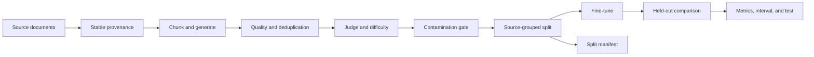

# Forge

[](https://github.com/pugalenthi0928/training-data-factory/actions)
[](https://www.python.org/)
[](LICENSE)

Source-aware training data generation, quality checks, and evaluation workflows.

Forge turns documents into task-specific examples, carries source provenance through the pipeline, prevents one source document from appearing in both train and test, checks generated data against a supplied benchmark, and records the artifacts needed to inspect a run.

**[Run the browser demo](https://pugalenthi0928.github.io/training-data-factory/demo.html) | [Evidence](https://pugalenthi0928.github.io/training-data-factory/) | [Technical controls](https://pugalenthi0928.github.io/training-data-factory/technical.html)**

The browser demo runs deterministic provenance, contamination, and source-safe split controls without installation or an API key. It is a smoke demo of pipeline behaviour, not a model-quality benchmark.

## Current status

Forge is in a technical hardening phase. The core pipeline and local MLX fine-tuning path are implemented. Source-safe splitting, mandatory contamination checks, deterministic provenance IDs, Ruff, Mypy, and Pytest are enforced in the repository.

Historical model results are not presented as independent evidence. The earlier run used references derived from the same generation process, and the same model family was used for generation and judging. Those artifacts are retained for traceability, not as a headline performance claim.

The next release gate is an independently authored evaluation set plus a human-reviewed scoring subset.

## Why this repository exists

Training data work is easy to demo and difficult to validate. Forge makes the trust boundaries visible:

| Risk | Repository control |
| --- | --- |
| The same source appears in train and test | Whole documents are assigned to one partition by `document_id` |
| Provenance changes between runs | Document and chunk IDs are content-derived and deterministic |
| A split cannot be audited | The split manifest records counts, overlap checks, seed, and SHA-256 artifact hashes |
| Evaluation data leaks into training | A supplied benchmark is mandatory and contamination can fail the run |
| A statistical test is mislabeled | The benchmark reports a paired randomization test and a paired bootstrap confidence interval separately |
| A failed stage is silently ignored | The one-command pipeline exits when a required stage fails |

## Pipeline



The held-out comparison is an internal regression check until the independent evaluation release is complete.

## Quick start

Requirements: Python 3.11 or newer.

```bash
git clone https://github.com/pugalenthi0928/training-data-factory.git
cd training-data-factory
make install
make forge
```

`make forge` is an offline smoke run. It uses the dummy model and a small synthetic contamination fixture to exercise the pipeline without API calls. The fixture tests the mechanism only. It is not a model benchmark.

Outputs are written to a timestamped directory under `runs/`, including:

- `config.json`
- `pipeline_log.json`
- `contamination_report.json`
- `split_manifest.json`
- `train.jsonl`
- `test.jsonl`

## Run with a real generator

Provide your own independent benchmark file. Each JSONL record should contain text in a supported field such as `question`, `text`, `input`, or `context`.

```bash
export OPENAI_API_KEY="your-key"
export FORGE_BENCHMARK_FILE="/absolute/path/to/independent_eval.jsonl"
make forge-live
```

The live command fails if the benchmark is absent, cannot be loaded, or triggers the contamination threshold. Fine-tuning uses MLX and therefore requires compatible Apple Silicon for the current local path.

## Source-safe split

The split command groups records by `document_id`. It refuses rows without source provenance and refuses datasets with fewer than two unique sources.

```bash
python scripts/split_dataset.py \
  --input run/dataset.jsonl \
  --train-output run/train.jsonl \
  --test-output run/test.jsonl \
  --manifest-output run/split_manifest.json \
  --test-fraction 0.2 \
  --seed 42
```

The command verifies that neither `document_id` nor available `chunk_id` values cross partitions.

## Evaluation semantics

The benchmark harness compares paired predictions with the same references and reports:

- ROUGE-1, ROUGE-2, and ROUGE-L
- exact match
- paired mean deltas
- a one-sided paired randomization p-value with plus-one correction
- a 95 percent paired bootstrap interval for the ROUGE-L delta
- the seed and resample count used by each procedure

These statistics quantify uncertainty in a particular evaluation set. They do not establish general model quality, remove judge bias, or substitute for an independently constructed benchmark.

## Repository layout

```text
src/training_data_robo/
  models.py          Stable document, chunk, and example provenance
  bot.py             High-level orchestration
  quality.py         Deterministic quality checks
  contamination.py   N-gram overlap detection
  judge.py           Rubric-based model judging
  selector.py        Quality, diversity, balance, and curriculum selection
  pipeline.py        DAG execution, caching, and resume

scripts/
  run_forge.py            End-to-end pipeline entry point
  split_dataset.py        Source-grouped train and test split
  check_contamination.py  Benchmark overlap gate
  benchmark.py            Paired model comparison and uncertainty
  finetune_mlx.py         Local LoRA fine-tuning

tests/                    Unit, property, provenance, and integrity tests
sample_docs/              Public smoke-test source documents
sample_benchmarks/        Synthetic contamination mechanism fixture
```

## Development checks

```bash
make lint
make typecheck
make test
make coverage
```

CI runs linting, format checks, type checking, syntax compilation, tests, and a coverage threshold on every push and pull request.

## Known limitations

- N-gram contamination detects verbatim and near-verbatim phrase overlap. It does not reliably catch paraphrases or semantic leakage.
- The current judge is model-based. A human-reviewed subset is still required before publishing evaluation claims.
- Exact-hash deduplication does not remove semantic duplicates. Stronger near-duplicate controls are planned.
- The included smoke benchmark is synthetic and deliberately small.
- The current local fine-tuning path is MLX-specific.

## Release criteria

Forge will be presented as evaluation-ready only after all of the following are public and reproducible:

1. An independently authored evaluation set with documented provenance.
2. A human-reviewed subset and an explicit scoring protocol.
3. Multiple training seeds or an equivalent uncertainty analysis for the selected experiment.
4. A clean one-command run from a fresh checkout.
5. CI passing on the tagged release.

## License

MIT
